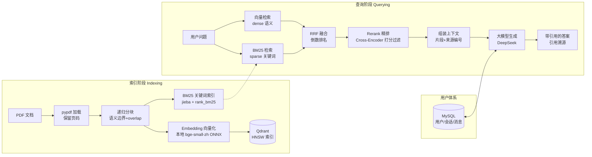

# 📚 RAG 私有知识库问答系统

> 基于 **LangChain + Qdrant + OpenAI 兼容 API** 的企业级检索增强生成（RAG）系统：上传 PDF 建立私有知识库，通过「向量 + BM25 混合检索 → Rerank 精排 → 大模型生成」多轮问答，并支持引用溯源、用户会话与一键容器化部署。


---

## 📌 一、项目简介

本项目是一个**面向私有文档的检索增强生成（RAG）智能问答系统**。你只需把 PDF 文档放入知识库目录，系统会自动完成解析、分块、向量化入库；之后以自然语言提问，系统会先从私有知识库检索最相关的片段，再交给大模型生成**带来源引用**的答案，避免大模型凭空编造。

适用于：企业内部知识问答、产品文档助手、学术资料检索、个人笔记问答等**对数据私密性要求高**的场景——知识库完全本地化，敏感数据不出内网。

**核心能力一览**：

- 📄 PDF 文档解析与递归分块
- 🔍 **向量 + BM25 混合检索**（RRF 融合，兼顾语义与精确匹配）
- ⚖️ **Rerank 交叉编码器精排**（从源头降低大模型幻觉）
- 💬 MySQL 持久化**多轮会话记忆** + JWT 登录鉴权
- ⚡ SSE 流式输出（打字机效果）+ **引用溯源**（答案附来源片段编号）
- 🖥️ Streamlit 聊天前端 + **Docker Compose 一键部署**

---

## 🎯 二、解决痛点

| 痛点 | 本项目的解法 |
|---|---|
| **大模型幻觉 / 答非所问** | 不直接让大模型自由发挥，而是先检索私有知识库，仅把**高置信片段**送入模型，并强制要求引用编号、剔除越界引用 |
| **关键词搜索不理解语义** | 向量检索（Embedding）把文本映射到高维语义空间，同义词、换说法也能召回 |
| **语义检索漏精确术语** | 叠加 BM25 关键词检索，专业术语、型号、编号能精确命中，RRF 融合两路结果 |
| **召回结果鱼龙混杂** | 引入 Rerank 交叉编码器对候选精排打分、阈值过滤，低相关片段不进上下文 |
| **多轮对话没有记忆** | MySQL 持久化会话历史，每次提问携带最近 N 轮上下文，支持「上面说的那个方案」式追问 |
| **数据隐私担忧** | Embedding / Rerank 模型**完全本地化运行**（ONNX），知识库不出内网；仅 Chat 走 OpenAI 兼容网关 |
| **部署复杂** | Docker Compose 一条命令拉起 MySQL + Qdrant + API + Web 四服务 |

---

## 🧰 三、技术栈

| 类别 | 技术 |
|---|---|
| **框架** | LangChain 0.3（LCEL 集成）、FastAPI、Pydantic v2 / pydantic-settings |
| **向量库** | Qdrant（HNSW 近似最近邻索引，支持本地文件与远程两种模式） |
| **检索** | 向量检索（dense） + BM25（jieba 分词 + rank_bm25） + RRF 融合 |
| **模型** | Chat：DeepSeek（OpenAI 兼容 API）；Embedding：BAAI/bge-small-zh-v1.5（本地 ONNX，512 维）；Rerank：Xenova/bge-reranker-base（本地 ONNX） |
| **数据层** | MySQL 8.0（用户 / 会话 / 消息持久化，SQLAlchemy ORM） |
| **API / 前端** | REST + SSE 流式（FastAPI）、JWT 鉴权、Streamlit 聊天界面 |
| **工程化** | Docker / Docker Compose、pytest、日志系统、异常体系、超时重试、参数校验 |

> 💡 通过 `RAG_OPENAI_BASE_URL` 可对接任意 OpenAI 兼容网关（DeepSeek / OpenAI / 通义 / vLLM / OneAPI 等），Chat 与 Embedding 支持**分离部署**。

---

## ✨ 四、功能清单

**文档接入**
- [x] PDF 加载解析（pypdf，保留页码元数据）
- [x] 递归字符分块（chunk_size / overlap 可配置，支持中文分隔符）
- [x] 批量文档入库、集合统计、幂等建表

**检索增强**
- [x] 向量检索（语义相似度）
- [x] BM25 关键词检索（jieba 分词）
- [x] RRF 倒数排名融合（规避两路分数尺度不一致）
- [x] Rerank 交叉编码器精排 + 可选阈值过滤
- [x] 检索召回逐条日志审计（来源 / 页码 / 分数 / 摘要）

**对话系统**
- [x] 用户注册 / 登录（PBKDF2 加盐哈希），JWT 鉴权
- [x] 多会话隔离、会话归属校验（越权返回 404）
- [x] MySQL 持久化多轮对话记忆（最近 N 轮上下文）
- [x] SSE 流式输出（打字机效果）
- [x] 答案引用溯源：`[编号]` 标注 + 来源片段卡片，越界引用自动剔除

**部署与工程**
- [x] CLI 工具（ingest / query / stats / drop / serve）
- [x] Docker Compose 一键部署四服务 + 健康检查 + 命名卷持久化
- [x] 离线单元测试（pytest，本地 Qdrant + 假 OpenAI，无需真实 API）

---

## 🏗️ 五、架构设计

### 整体流程图



### 分层模块结构

```
rag-langchain-qdrant/
├── main.py                    # CLI 入口（ingest / query / stats / drop / serve）
├── config/settings.py         # pydantic-settings 集中配置 + 启动参数校验
├── core/                      # 基础设施：统一异常 / 日志 / JWT+密码哈希
├── ingestion/                 # 数据接入：PDF 加载、递归分块
├── vectorstore/               # 向量存储：Embedding 客户端、Qdrant 封装
├── service/                   # 业务服务：混合检索 / BM25 / Rerank / 生成 / 流水线 / 多轮对话
├── persistence/               # 持久层：MySQL 连接池 / ORM 模型 / 仓储
├── api/                       # FastAPI 层：认证 / 会话 / 对话路由、依赖注入、异常转 HTTP
├── webapp/app.py              # Streamlit 聊天前端
├── tests/                     # 离线冒烟测试 + 检索/安全单元测试
├── Dockerfile / Dockerfile.webapp / docker-compose.yml / entrypoint.sh
├── .env.example               # 环境变量模板（复制为 .env）
└── DEPLOY.md                  # 完整部署教程
```

---

## 🚀 六、部署步骤

### 方式一：Docker Compose 一键部署（推荐）

**前置要求**：Docker + Docker Compose；一个 OpenAI 兼容网关的 API Key（如 DeepSeek）。

```bash
# 1. 克隆 / 进入项目，准备环境变量
cp .env.example .env
# 编辑 .env，至少填写：
#   RAG_OPENAI_API_KEY=sk-xxx          # Chat 模型网关 Key
#   MYSQL_ROOT_PASSWORD=你的数据库密码  # MySQL root 密码

# 2. 一键拉起四服务（mysql / qdrant / api / webapp）
docker compose up -d --build

# 3. 把知识文档放入 ./docs 目录，然后在 api 容器内灌库
docker compose exec api python main.py ingest /app/docs/你的文档.pdf

# 4. 访问
#   前端聊天界面: http://localhost:8501
#   API 接口文档: http://localhost:8000/docs
```

首次启动会自动下载本地 Embedding / Rerank 模型（走 hf-mirror 镜像），并自动建库建表。

### 方式二：本地开发运行

```bash
# 1. Python 3.10+ 环境
python -m venv .venv
# Windows: .venv\Scripts\activate | Linux/macOS: source .venv/bin/activate
pip install -r requirements.txt

# 2. 配置 .env（可选本地 Qdrant 文件模式，不填 RAG_QDRANT_URL 即用本地目录）
cp .env.example .env

# 3. 灌库 + 提问
python main.py ingest ./docs/测试知识文档.pdf
python main.py query "什么是 RAG？"

# 4. 启动 HTTP 服务 + 前端
python main.py serve                      # http://127.0.0.1:8000/docs
pip install -r webapp/requirements.txt
$env:API_BASE_URL="http://127.0.0.1:8000/api"   # Windows
streamlit run webapp/app.py               # http://localhost:8501

# 5. 运行离线测试
python -m pytest tests/ -v
```

### 关键配置说明（.env）

| 配置项 | 说明 |
|---|---|
| `RAG_OPENAI_BASE_URL` / `RAG_OPENAI_API_KEY` | OpenAI 兼容网关地址与 Key |
| `RAG_EMBEDDING_PROVIDER` | `local_fastembed`（本地离线）或 `openai_compatible`（远端） |
| `RAG_RETRIEVAL_MODE` | `hybrid`（向量+BM25，推荐）或 `vector`（纯向量） |
| `RAG_ENABLE_RERANK` | 是否开启 Rerank 精排 |
| `RAG_MYSQL_*` / `RAG_JWT_SECRET` | MySQL 连接与 JWT 密钥（生产务必修改） |

> ⚠️ `.env` 含敏感信息，已被 `.gitignore` / `.dockerignore` 排除，不会进入 Git 或 Docker 镜像。

---

## 💡 七、优化亮点

1. **分层解耦架构**：数据接入 / 向量存储 / 检索 / 生成各层仅依赖相邻层抽象输入，任一层可独立替换（如换 OCR 加载、换向量库、换大模型），便于测试与演进。
2. **混合检索 + Rerank 双保险降幻觉**：向量召回语义 + BM25 精确命中 → RRF 融合扩大覆盖 → 交叉编码器精排过滤，从源头把「高置信片段」才送入模型，配合引用编号校验，显著降低幻觉。
3. **全链路工程健壮性**：
   - 外部调用统一**超时 + 自动重试**，失败可降级（Rerank 失败自动退化为不重排，增强项不阻断主流程）；
   - 统一 `RAGError` 异常体系，全局兜底；
   - 配置**启动即校验**（fail-fast），非法值绝不带病运行。
4. **检索召回可审计**：对「向量召回 / BM25 召回 / RRF 融合 / Rerank 精排」逐条记录来源、页码、分数、片段摘要到日志，满足召回内容审计需求。
5. **隐私优先**：Embedding 与 Rerank 模型全部本地 ONNX 运行，离线免费、无额度限制、知识不出内网。
6. **SSE 流式 + 引用溯源**：打字机式流式输出提升体验；答案自动标注 `[编号]`，前端渲染可点击溯源卡片，越界引用自动剔除。
7. **权限与隔离**：PBKDF2 加盐哈希存储密码，JWT 鉴权 + 会话归属校验，多用户数据严格隔离。

---

## ⚠️ 八、已知缺陷与后续改进方向

### 已知局限

- **扫描版 PDF 不支持**：`pypdf` 仅抽取文本层，扫描件 / 图片型 PDF 需接入 OCR（如 PaddleOCR）。
- **检索参数需调优**：`chunk_size` / `overlap` / `top_k` / Rerank 阈值需在真实语料上按召回率 / 命中率实验调参，默认值面向通用场景。
- **多路召回在超大规模库上的性能**：BM25 索引基于全量内存构建，文档量极大时需评估内存占用。
- **单机部署形态**：Docker Compose 适合中小规模 / 内网部署，未做集群与高可用。

### 后续改进方向（Roadmap）

- [ ] **OCR 支持**：集成 PaddleOCR，打通扫描版 / 图片型 PDF
- [ ] **增量更新**：支持文档增删改的增量入库，避免全量重建索引
- [ ] **父子分块 / 语义分块**：检索小片段、回填大上下文，进一步提升回答质量
- [ ] **检索评估体系**：引入召回率 / 命中率 / 忠实度评估脚本与评测集
- [ ] **流式重排性能优化**：对大规模候选做 ANN + 两阶段重排
- [ ] **监控埋点**：接入 OpenTelemetry，观测检索链路时延与召回质量
- [ ] **多租户 / 权限体系**：按文档粒度控制可见范围
- [ ] **多格式支持**：Word / Markdown / HTML / Excel 文档接入

---

## 📄 License

MIT License

## 🙏 致谢

- [LangChain](https://www.langchain.com) / [Qdrant](https://qdrant.tech) / [FastAPI](https://fastapi.tiangolo.com)
- [DeepSeek](https://www.deepseek.com)（OpenAI 兼容网关）
- [bge-small-zh-v1.5](https://huggingface.co/BAAI/bge-small-zh-v1.5) / [bge-reranker-base](https://huggingface.co/BAAI/bge-reranker-base)（本地 Embedding / Rerank 模型）
